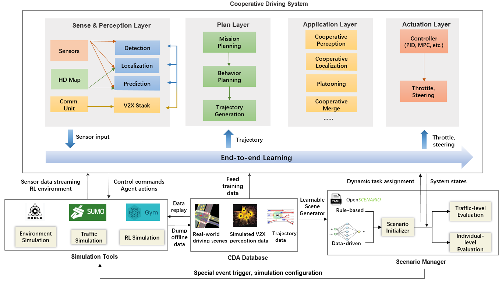

# OpenCDA
[](https://travis-ci.com/ucla-mobility/OpenCDA)
[](https://coveralls.io/github/ucla-mobility/OpenCDA?branch=feature/readme_revise)
[](https://opencda-documentation.readthedocs.io/en/latest/?badge=latest)


OpenCDA is an open co-simulation-based **research/engineering framework** integrated with prototype cooperative driving automation (CDA; see [SAE J3216](https://www.sae.org/standards/content/j3216_202005/)) pipelines as well as regular automated driving components (e.g., perception, localization, planning, control).  It not only enables CDA evaluation in a CARLA + SUMO co-simulation environment but also provides a rich library of source codes of CDA research pipelines. 

In collaboration with  [U.S.DOT CDA Research](https://its.dot.gov/cda/) and the [FHWA CARMA Program](https://highways.dot.gov/research/operations/CARMA), OpenCDA, as an open-source project, is designed and built to support <strong>early-stage fundamental research </strong>  for CDA research and development. Through collaboration with CARMA Collaborative, this tool provides a unique capability to the CDA research community and will interface with the [CARMA XiL tools](https://github.com/usdot-fhwa-stol/carma-simulation) being developed by U.S.DOT to support more advanced simulation testing of CDA Features.


The key features of OpenCDA are:
* <strong> Research Pipeline </strong>: OpenCDA provides rich research pipelines (i.e., open-source codes for basic and advanced CDA modules, such as platooning, cooperative perception).
* <strong>Integration</strong>: OpenCDA utilizes CARLA and SUMO separately, as well as integrates them together.
* <strong> Full-stack Simulation</strong>: OpenCDA provides a simple prototype automated driving and cooperative driving platform, <strong>all in Python</strong>, that contains perception, localization, planning, control, and V2X communication modules.
* <strong>Modularity</strong>: OpenCDA is highly modularized. 
* <strong>Benchmark</strong>: OpenCDA offers benchmark testing scenarios, benchmark baseline maps, state-of-the-art benchmark algorithms, and benchmark evaluation metrics.
* <strong>Connectivity and Cooperation</strong>: OpenCDA supports various levels and categories of cooperation between CAVs in simulation. This differentiates OpenCDA from other single vehicle simulation tools.


Users could refer to [OpenCDA documentation](https://opencda-documentation.readthedocs.io/en/latest/) for more details.

## What's New
### March 2022
* HD Map manager is online! It currently supports generating rasterization map that includes road topology, traffic light info, and dynamic objects around each cav in real-time. This can be
used for RL planning, HD Map learning, scene understanding, etc.

### Feb 2022
* Our paper [*OPV2V: An Open Benchmark Dataset and Fusion Pipeline for Perception with Vehicle-to-Vehicle Communication*](https://arxiv.org/abs/2109.07644)
  has been accepted by ICRA 2022! It utilizes  the offline Cooperative Perception(data dumping) function in OpenCDA. Check the benchmark codebase [OpenCOOD](https://github.com/DerrickXuNu/OpenCOOD) of OPV2V if interested.
### Oct 2021
 * CARLA 0.9.12 now supported; Different weather conditions are supported.
 * Better traffic management supported: users now can set a customized range to background cars.


## Major Components


OpenCDA  consists of four major component: <strong>Cooperative Driving System</strong>,  <strong>Co-Simulation Tools</strong>, <strong>Data Manager and Repository</strong>,
and  <strong>Scenario Manager</strong>.

Check the [OpenCDA Introduction](https://opencda-documentation.readthedocs.io/en/latest/md_files/introduction.html) for more details.


## Get Started

 


### Users Guide
* [Overview](https://opencda-documentation.readthedocs.io/en/latest/md_files/introduction.html)
* [Installation](https://opencda-documentation.readthedocs.io/en/latest/md_files/installation.html)
* [Quick Start](https://opencda-documentation.readthedocs.io/en/latest/md_files/getstarted.html)
* [Logic Flow](https://opencda-documentation.readthedocs.io/en/latest/md_files/logic_flow.html)
* [Traffic Generation](https://opencda-documentation.readthedocs.io/en/latest/md_files/traffic_generation.html)


Note: We continuously improve the performance of OpenCDA. Currently, it is mainly tested in our customized maps and
 Carla town06 map; therefore, we <strong>DO NOT </strong> guarantee the same level of  robustness in other maps.

### Developer Guide

*  [Class Design](https://opencda-documentation.readthedocs.io/en/latest/md_files/developer_tutorial.html)
*  [Customize Your Algorithms](https://opencda-documentation.readthedocs.io/en/latest/md_files/customization.html)
*  [API Reference](https://opencda-documentation.readthedocs.io/en/latest/modules.html) <br>


### Contribution Rule
We welcome your contributions.
- Please report bugs and improvements by submitting issues.
- Submit your contributions using [pull requests](https://github.com/ucla-mobility/OpenCDA/pulls).
 Please use [this template](.github/PR_TEMPLATE.md) for your pull requests.


## Citation
 If you are using our OpenCDA framework or codes for your development, please cite the following paper:
 ```bibtex
@inproceedings{xu2021opencda,
  title={OpenCDA: an open cooperative driving automation framework integrated with co-simulation},
  author={Xu, Runsheng and Guo, Yi and Han, Xu and Xia, Xin and Xiang, Hao and Ma, Jiaqi},
  booktitle={2021 IEEE International Intelligent Transportation Systems Conference (ITSC)},
  pages={1155--1162},
  year={2021},
  organization={IEEE}
}
```
The arxiv link to the paper:  https://arxiv.org/abs/2107.06260

Also, under this LICENSE, OpenCDA is for non-commercial research only. Researchers can modify the source code for their own research only. Contracted work that generates corporate revenues and other general commercial use are prohibited under this LICENSE. See the LICENSE file for details and possible opportunities for commercial use.

## Contributors
OpenCDA is supported by the [UCLA Mobility Lab](https://mobility-lab.seas.ucla.edu/). <br>

### Lab Principal Investigator:
- Dr. Jiaqi Ma ([linkedin](https://www.linkedin.com/in/jiaqi-ma-17037838/),
               [UCLA Samueli](https://samueli.ucla.edu/people/jiaqi-ma/))

### Project Lead: <br>
 - Runsheng Xu ([linkedin](https://www.linkedin.com/in/runsheng-xu/), [github](https://github.com/DerrickXuNu))  <br>

### Team Members: 
 - Xu Han ([linkedin](https://linkedin.com/in/xu-han-12851a64), [github](https://github.com/xuhan417))
 - Hao Xiang ([linkedin](https://www.linkedin.com/in/hao-xiang-42bb5a1b2/), [github](https://github.com/XHwind))
 - Dr. Yi Guo ([linkedin](https://www.linkedin.com/in/yi-guo-4008baaa/))
 - Dr. Xin Xia ([linkedin](https://www.linkedin.com/in/yi-guo-4008baaa/))

