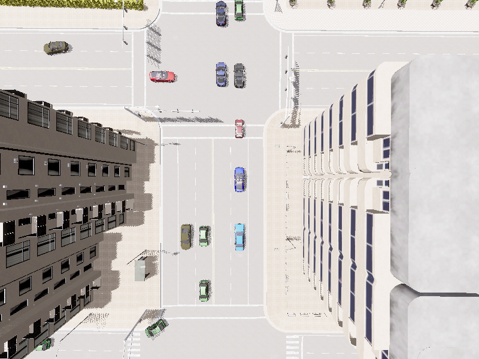
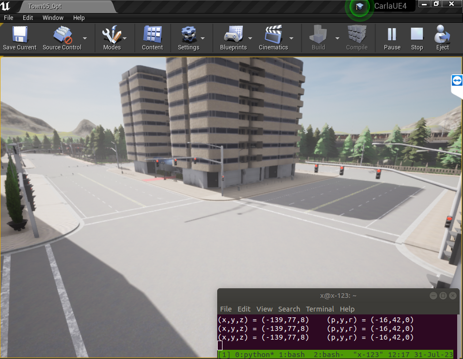
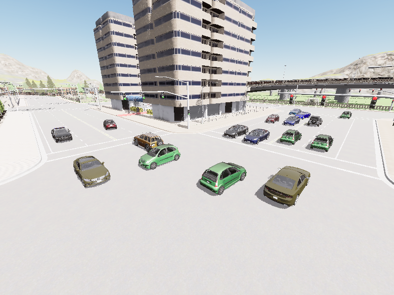
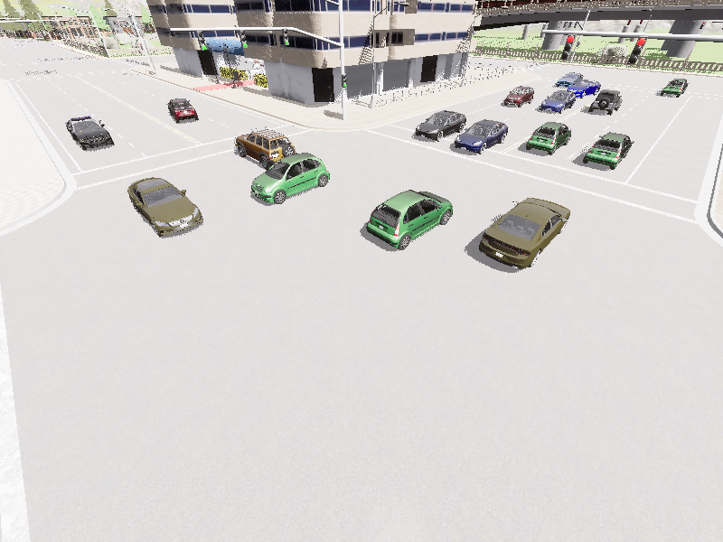

OpenCDA Replay
=
### Motivations:

* Open-source dataset [OPV2V](https://mobility-lab.seas.ucla.edu/opv2v/) offers comprehensive simulation data, e.g. RGB images, lidar point clouds and bounding boxes

* **OpenCOOD** framework provides dataset replay function and allows users to add sensors on vehicles and road-side units to generate images and point clouds, but **no bounding box generation**
* **OpenCDA** framework has bounding box generation function using ML detection libraries, but **does not have dataset replay function**
* This work makes extensions on OpenCDA by integrating replay function from OpenCOOD

### Remarks

- Carla provides numerous [pre-made maps](https://carla.readthedocs.io/en/latest/core_map/) for public benchmarking, I chose 'Town05' for its urban environment that better resembles my use cases. More can be included by adjusting line 90 in opencda_replay.py
    ```python
    target_towns = ['Town05']
    ```

- My project premarily focuses on analysis of lidar placement for Road-side Units, thus **only one vehicle actor** is used for simplicity.

    After each simulation in Carla, each actor generates recorded data with randomly assigned actor ID,
    - Vehicle actors have ID of *positive* numbers
    - RSU actors will have *negative* IDs (following formulation of V2XSet)

    Note that original OPV2V dataset has recordings of multiple (i.e. >1) vehicle actors, the one with smallest *positive* number is chosen as the ego vehicle while others will be treated as background vehicles

- For the sake of studying RSU lidar configurations, I needed to record and replay dataset with completely consistent environment while only adjusting lidar placement, i.e. replicating the same traffic conditions with the same cars and their trajectories. I added the 'base_dataset' mode to enable this.

### Workflows:

Pre-requisite: run Carla simulator with 'make launch' and start by pressing play -> 'Simulate'

1. Generate bird's eye view images of each scene
    ```python
    python opencda_replay.py -t logreplay_bev -r ROOT_DIR -o OUTPUT_DIR_BEV
    ``` 

    Example: (scene: test/2021_08_23_12_58_19)
    <!--  -->
    


2. Select desired intersections and log lidar locations for analysis

    - Specifically, lidars in Carla simulator require position arguments (x, y, z, pitch, yaw, roll). Need to record manually
    - *Efforts attempted*: wrote scripts to extract traffic light information and use them to automatically assign lidar coordinates. However, in the pre-defined Carla maps, some intersections with traffic lights may not have traffic at all (i.e. useless to record), while other intersections with no traffic lights are crowded. Therefore, for Carla's provided maps, we need to inspect manually
    
    ```python
    python utils/print_spectactor_coord.py
    ```

    This script (credit: [@damascenodiego/print_spectactor_coord.py](https://gist.github.com/damascenodiego/c53ae6960f1ebdcc25d41384392b6500)) prints real-time current coordinates while user roams around in the simulation world

    Example:

    

    See example results at 'OpenCDA/opencda/scenario_testing/utils/rsu.json'

3. Replay original OPV2V dataset to generate base dataset

    

    ```python
    python opencda_replay.py -t logreplay -b -r ROOT_DIR -o OUTPUT_DIR_BASE
    # -b --base_dataset: boolean flag indicating whether replaying on original OPV2V dataset to generate base dataset
    ```

    Example: pitch = -20

    <!--  -->
    

    See automation bash script for reference:
    > OpenCDA/automate_opencda.sh

4. Replay base dataset to generate variant dataset

    Examples of 'variant dataset' include, different lidar placements with varying **(x, y, z) coordiantes** and **pitch angles**

    \* Currently **only pitch angle** is allowed for variation (see line 75 in opencda_replay.py), other adjustment parameters to be further extended

    ```python
    python opencda_replay.py -t logreplay -r OUTPUT_DIR_BASE -o OUTPUT_DIR_VAR
    ```

    Example: pitch = -40

    <!--  -->
    

    Notes: original dataset **did not record background vehicle information** (e.g. car model and color). Therefore, we first generate base dataset and these infnormation will be available for extensive replication
