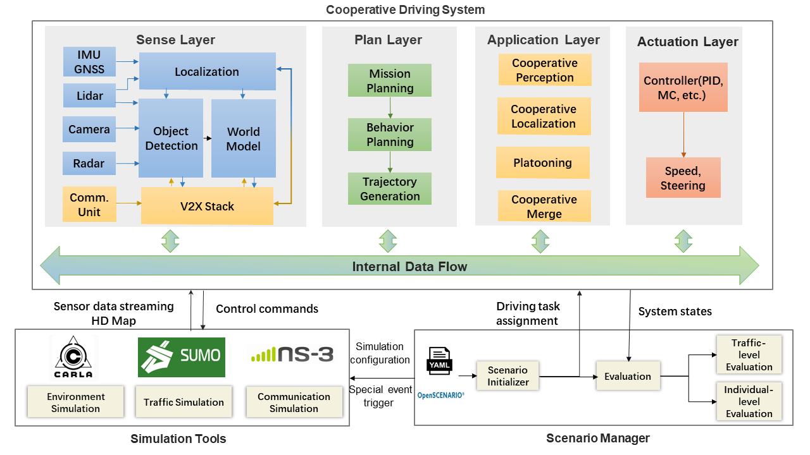

### Why OpenCDA?
Current autonomous driving simulation platforms that support scene rendering and traffic simulation mainly concentrate
on single-vehicle intelligence, therefore, developing and testing Cooperative Driving Automation applications(e.g., cooperative perception,
cooperative merge) under a realistic simulated environment becomes difficult.
 
 OpenCDA is created to fill such gap.

### Major Components

 1. <em>Cooperative Driving System</em>:   OpenCDA  provides  a  <strong> full-stack software </strong>  that  contains  the  common  self-driving  modules including
  <strong> sensing,   planning and actuation  layers </strong>,  and  it  is  developed  purely  in  Python for fast prototyping.
  Built  upon these basic modules, OpenCDA supports a range of  <strong> common cooperative  driving  applications</strong>.  
 2. <em>Co-Simulation Tools</em>:  OpenCDA provides interfaces to integrate multiple open-source simulation tools
 with the cooperative driving system. Through the interfaces, OpenCDA is able to take advantage of the high-quality scene rendering
 and realistic dynamic modelling from <strong> CARLA</strong> , the realistic traffic simulation from <strong>SUMO</strong>, and the network communication from <strong> NS3</strong> .
 (SUMO and NS3 will be shown in OpenCDA in the next version v0.2).  
 3. <em>Scenario Manager</em>:   By defining the parameters in the Yaml file,  OpenCDA is able to <strong> construct the simulation scenario</strong>,
<strong> creating the traffic flows</strong>, and <strong> assigning various dynamic driving tasks </strong> to different connected automated vehicles. 
 Through such lightweight configuration, researchers can conveniently test and evaluate their algorithms under different scenarios. In the next verision v0.2, 
 OpenScenario will be supported to trigger special events.

### Features in current version
* Support both cooperative driving automation and single autonomous vehicle development in CARLA simulator.
* Default scenario database provided.
* Convenient API provided to construct scenario and traffic flow(less than 5 lines of code). All parameters during simulation
can be defined in yaml file.
* Default algorithms installed for perception, localization, planning, control, platooning and cooperative merging.
* Lossless and simultaneous communications between connected automated vehicles supported.
* Highly modularized, users can replace the default modules with their own implementation easily.
* Various visualization and performance analysis tools integrated.

### Planned features in the next version
* Add SUMO and NS3 to the framework.
* Cooperative localization implementation.

