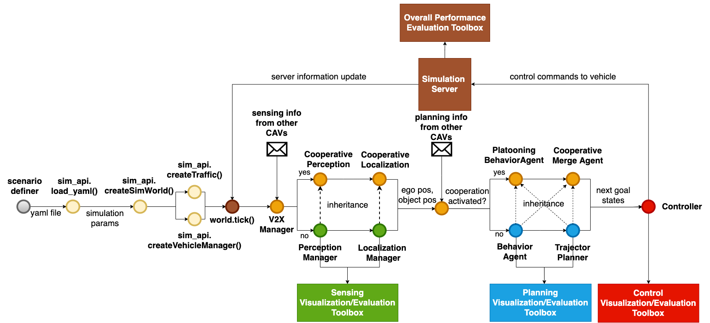

##  OpenCDA Tutorial
In this section,  we will introduce the logic flow to construct a scenario and test the default/customized 
algoirhtms in OpenCDA.

### Codebase Structure
Check the [codebase structure](codebase_structure.md) to see how the codes distributed in OpenCDA.

### Overview
As the figure below depicts, to run simulation testings in OpenCDA, there are five general steps:

1. The user has to first write a yaml file to configure the settings of simulation server(e.g. sync mode vs async mode), 
the specifications of the traffic flow(e.g. the number of human drive vehicles, spawn positions,), and the parameters of 
each Connected Automated  Vehicle(e.g. lidar parameters, detection model, trajectory smoothness).
2. The <strong> Scenario Manager </strong> will load the yaml file, and deliver the necessary information to CARLA
server to set simulation setting, create traffic flow and generate the CAVs. Each CAV is managed by a class called 
`VehicleManager`.
3. The simulation server information will pass to each `VehicleManager`. Based on whether the corresponding cooperative
modules are activated, the `VehicleManager` will select different perception, localization, and planning modules to send
the planned trajectory to the `ControlManager`. The controller will produce control commands and deliver to the  simulation server.
4. The simulation server will apply the received control commands to the vehicles, execute a single step, and return the updated
information to the `VehicleManager` for next round running.
5. After simulation is over, `EvaluaitonManager` will evaluate different modules' performance and save the statistics.

### Step1: Define the yaml file

