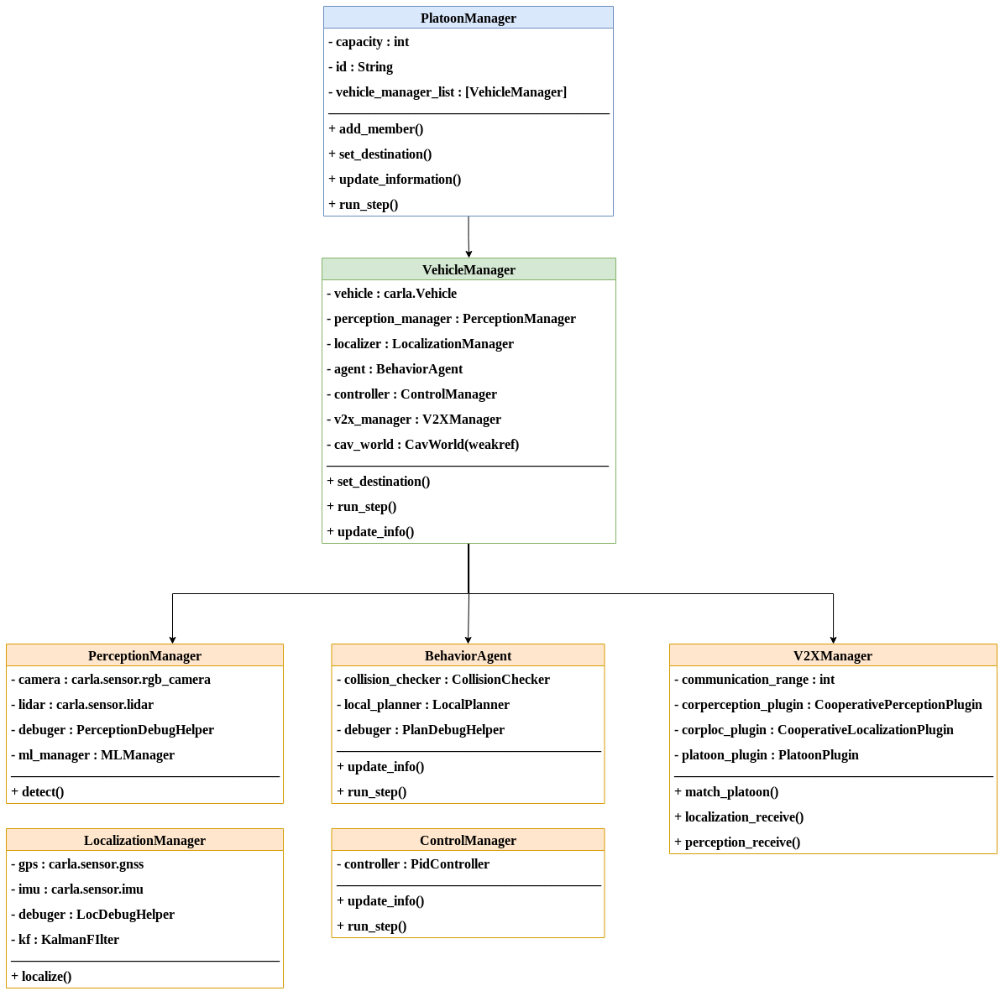

##  OpenCDA Tutorial
In this section,  we will introduce the logic flow to construct a scenario and test the default/customized 
algoirhtms in OpenCDA.

### Codebase Structure
Check the [codebase structure](codebase_structure.md) to see how the codes distributed in OpenCDA.

### Overview
As the figure below depicts, to run simulation testings in OpenCDA, there are five general steps:

1. The user has to first write a yaml file to configure the settings of simulation server(e.g. sync mode vs async mode), 
the specifications of the traffic flow(e.g. the number of human drive vehicles, spawn positions,), and the parameters of 
each Connected Automated  Vehicle(e.g. lidar parameters, detection model, trajectory smoothness).
2. The <strong> Scenario Manager </strong> will load the yaml file, and deliver the necessary information to CARLA
server to set simulation setting, create traffic flow and generate the CAVs. Each CAV is managed by a class called 
`VehicleManager`.
3. The simulation server information will pass to each `VehicleManager`. Based on whether the corresponding cooperative
modules are activated, the `VehicleManager` will select different perception, localization, and planning modules to send
the planned trajectory to the `ControlManager`. The controller will produce control commands and deliver to the  simulation server.
4. The simulation server will apply the received control commands to the vehicles, execute a single step, and return the updated
information to the `VehicleManager` for next round running.
5. After simulation is over, `EvaluaitonManager` will evaluate different modules' performance and save the statistics.


### Step1: Define the yaml file
Check the [Yaml Define Rule](yaml_define.md) to see how to write a yaml file to define
your scenario.

### Step2: Construct scenario
After the yaml file is given, the <strong>Scenario Manager </strong> will load the file
and construct the scenario through `opencda sim_api and map_api`.

```python
import opencda.scenario_testing.utils.sim_api as sim_api
import opencda.scenario_testing.utils.customized_map_api as map_api
from opencda.scenario_testing.utils.yaml_utils import load_yaml

# Aad yaml file into a dictionary
scenario_params = load_yaml(config_yaml)

# setup the simulation server configuration
simulation_config = scenario_params['world']
client, world, carla_map, origin_settings = sim_api.createSimulationWorld(simulation_config, 'town06')

# create background traffic in carla
traffic_manager, bg_veh_list = sim_api.createTrafficManager(client, world,
                                                            scenario_params['carla_traffic_manager'])

# create platoon members
platoon_list, cav_world = sim_api.createPlatoonManagers(world, carla_map, scenario_params, opt.apply_ml)

# create single cavs
single_cav_list = sim_api.createVehicleManager(world, scenario_params, ['platooning'], cav_world,
                                               carla_map)


```
As you can observe from the above scripts, <strong>only less than 10 lines of codes</strong> 
are needed to construct a complex scenario!

### Step3: Execute a single step
A simplified class diagram design is shown below.
The core class in OpenCDA is `VehicleManager`, which is the base class for any cooperative driving applications(e.g. `PlatoonManager`
is built upon `VehicleManager` ). It contains the necessary modules such as `PerceptionManager` and
`LocalizationManager`.



Based on whether certain cooperative driving application is activated,
`VehicleManager` will choose different perception/localization/planning manager.
```python
# vehicle_manager.py
class VehicleManager:
    def __init__(self, vehicle, config_yaml, application, carla_map, cav_world):
        if 'platooning' in application:
            platoon_config = config_yaml['platoon']
            self.agent = PlatooningBehaviorAgent(vehicle, self, self.v2x_manager,
                                                 behavior_config, platoon_config, carla_map)
        else:
            self.agent = BehaviorAgent(vehicle, carla_map, behavior_config)

```
During runtime, `VehicleManager` will first localize and detect the surrounding objects,
and then pass the computed information to v2x stack, planner and controller. Then the donwstream
modules will fuse information from different cavs, generate trajectory and control commands.
```python
class VehicleManager:
        def update_info(self):
            # localization
            self.localizer.localize()
            ego_pos = self.localizer.get_ego_pos()
            ego_spd = self.localizer.get_ego_spd()
    
            # object detection
            objects = self.perception_manager.detect(ego_pos)
    
            self.v2x_manager.update_info(ego_pos, ego_spd)
            self.agent.update_information(ego_pos, ego_spd, objects)
            # pass position and speed info to controller
            self.controller.update_info(ego_pos, ego_spd)
            
        def run_step(self, target_speed=None):
            target_speed, target_pos = self.agent.run_step(target_speed)
            control = self.controller.run_step(target_speed, target_pos)
            return control

```

### Step4: Keep the simulation loop running
```python
while True:
    world.tick()
    single_cav.update_info()
    control = single_cav.run_step()
    single_cav.vehicle.apply_control(control)
```

### Step5: Evaluation
When the simulation is over, the `EvaluationManager` will evaluate the performance,
and save the results in `~/OpenCDA/evluation_outputs`
```python
# create evaluation manager
eval_manager = EvaluationManager(cav_world)
eval_manager.evaluate()
```

### Customize your own algorithms
Due the high modularity of OpenCDA, you can conveniently replace any default module with your own
algorithms. It is highly recommended to put your customized module under `opencda/customize/..` and apply
inheritance to overwrite the default algorithm. <br>
Here we show an example of customizing localzation module. The default localization selects Kalman Filter
as the fusing algorim, and we aim to use Extended Kalman Filter to replace it.<br>
Under `opencda/customize/core/sensing/localization`, create `localization_manager.py` that inherit 
the origin localization module and overrite the Kalman Filter with Extended Kalman Filter:
```python
from opencda.core.sensing.localization.localization_manager import LocalizationManager
from opencda.customize.core.sensing.localization.extented_kalman_filter import ExtentedKalmanFilter

class CustomizedLocalizationManager(LocalizationManager):
    def __init__(self, vehicle, config_yaml, carla_map):
        super(CustomizedLocalizationManager, self).__init__(vehicle, config_yaml, carla_map)
        self.kf = ExtentedKalmanFilter(self.dt)
``` 

Then go to `VehicleManager` class, import this customized module and set it as the localizer.
```python
from opencda.core.sensing.localization.localization_manager import LocalizationManager
from opencda.customize.core.sensing.localization.localization_manager import CustomizedLocalizationManager

class VehicleManager(object):
    def __init__(self, vehicle, config_yaml, application, carla_map, cav_world):
        # self.localizer = LocalizationManager(vehicle, sensing_config['localization'], carla_map)
        self.localizer = CustomizedLocalizationManager(vehicle, sensing_config['localization'], carla_map)
```
As long as you <strong>keep the input and output format as the origin imlementation</strong>, customization will 
be a very simple job.
  