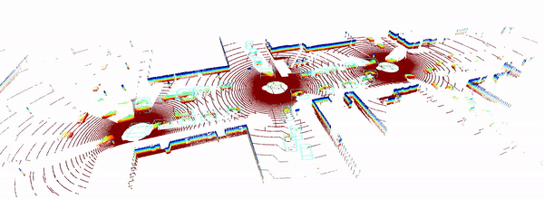
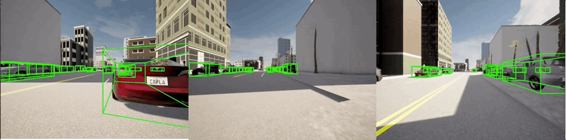

<div align="center">
  
  <div>&nbsp;</div>

  <div>&nbsp;</div>
</div>

[](https://arxiv.org/pdf/2109.07644.pdf)
[](https://opencood.readthedocs.io/en/latest/?badge=latest) 
[](https://opensource.org/licenses/MIT) 

OpenCOOD is an <strong>Open</strong> <strong>COO</strong>perative <strong>D</strong>etection framework for autonomous driving. It is also the official implementation of the <strong> ICRA 2022  </strong>
paper [OPV2V.](https://arxiv.org/abs/2109.07644)

<p align="center">


</p>

## News:
- 12/28/2022: OpenCOOD now support multi-gpu training.
- 12/21/2022: V2XSet (ECCV2022) is supported by OpenCOOD now!
- 12/16/2022: Both spconv 1.2.1 and spconv 2.x are supported! 
- 12/04/2022: The log replay tool for OPV2V is online now! With 
this toolbox, you can 100% replay all the events in the offline dataset and add/change any sensors/groundtruth you
want to explore the tasks that the origin dataset do not support. Check [here](logreplay/README.md) to see more details.
- 09/15/2022: So far OpenCOOD has supported several top conference papers, including ECCV,ICRA,CoRL,NeurIPS,WACV! The bottom of this project page lists the detailed information.
## Features
- Provide easy data API for multiple popular multi-agent perception dataset:
  - [x] [OPV2V [ICRA2022]](https://mobility-lab.seas.ucla.edu/opv2v/)
  - [x] [V2XSet [ECCV2022]](https://arxiv.org/pdf/2203.10638.pdf)
  - [ ] [DAIR-V2X [CVPR2022]](https://arxiv.org/abs/2204.05575)
- Provide APIs to allow users use different sensor modalities
  - [x] LiDAR APIs
  - [ ] Camera APIs
  - [ ] Radar APIs
- Provide multiple SOTA 3D detection backbone:
    - [X] [PointPillar](https://arxiv.org/abs/1812.05784)
    - [X] [Pixor](https://arxiv.org/abs/1902.06326)
    - [X] [VoxelNet](https://arxiv.org/abs/1711.06396)
    - [X] [SECOND](https://www.mdpi.com/1424-8220/18/10/3337)
- Support multiple sparse convolution versions
  - [X] Spconv 1.2.1
  - [X] Spconv 2.x
- Support  SOTA multi-agent perception models:
    - [x] [Attentive Fusion [ICRA2022]](https://arxiv.org/abs/2109.07644)
    - [x] [Cooper [ICDCS]](https://arxiv.org/abs/1905.05265)
    - [x] [F-Cooper [SEC2019]](https://arxiv.org/abs/1909.06459)
    - [x] [V2VNet [ECCV2022]](https://arxiv.org/abs/2008.07519)
    - [x] [FPV-RCNN [RAL2022]](https://arxiv.org/pdf/2109.11615.pdf)
    - [ ] [DiscoNet [NeurIPS2021]](https://arxiv.org/abs/2111.00643)
    - [x] [V2X-ViT [ECCV2022]](https://github.com/DerrickXuNu/v2x-vit)
    - [x] [CoBEVT [CoRL2022]](https://arxiv.org/abs/2207.02202)  
    - [ ] [AdaFusion [WACV2023]](https://arxiv.org/abs/2208.00116)  
    - [x] [Where2comm [NeurIPS2022]](https://arxiv.org/abs/2209.12836)

- **Provide a convenient log replay toolbox for OPV2V dataset.** Check [here](logreplay/README.md) to see more details.

## Data Downloading
All the data can be downloaded from [google drive](https://drive.google.com/drive/folders/1dkDeHlwOVbmgXcDazZvO6TFEZ6V_7WUu). If you have a good internet, you can directly
download the complete large zip file such as `train.zip`. In case you suffer from downloading large fiels, we also split each data set into small chunks, which can be found 
in the directory ending with `_chunks`, such as `train_chunks`. After downloading, please run the following command to each set to merge those chunks together:
```python
cat train.zip.part* > train.zip
unzip train.zip
```

## Installation
Please refer to [data introduction](https://opencood.readthedocs.io/en/latest/md_files/data_intro.html)
and [installation](https://opencood.readthedocs.io/en/latest/md_files/installation.html) guide to prepare
data and install OpenCOOD. To see more details of OPV2V data, please check [our website.](https://mobility-lab.seas.ucla.edu/opv2v/)

## Quick Start
### Data sequence visualization
To quickly visualize the LiDAR stream in the OPV2V dataset, first modify the `validate_dir`
in your `opencood/hypes_yaml/visualization.yaml` to the opv2v data path on your local machine, e.g. `opv2v/validate`,
and the run the following commond:
```python
cd ~/OpenCOOD
python opencood/visualization/vis_data_sequence.py [--color_mode ${COLOR_RENDERING_MODE}]
```
Arguments Explanation:
- `color_mode` : str type, indicating the lidar color rendering mode. You can choose from 'constant', 'intensity' or 'z-value'.


### Train your model
OpenCOOD uses yaml file to configure all the parameters for training. To train your own model
from scratch or a continued checkpoint, run the following commonds:
```python
python opencood/tools/train.py --hypes_yaml ${CONFIG_FILE} [--model_dir  ${CHECKPOINT_FOLDER} --half]
```
Arguments Explanation:
- `hypes_yaml`: the path of the training configuration file, e.g. `opencood/hypes_yaml/second_early_fusion.yaml`, meaning you want to train
an early fusion model which utilizes SECOND as the backbone. See [Tutorial 1: Config System](https://opencood.readthedocs.io/en/latest/md_files/config_tutorial.html) to learn more about the rules of the yaml files.
- `model_dir` (optional) : the path of the checkpoints. This is used to fine-tune the trained models. When the `model_dir` is
given, the trainer will discard the `hypes_yaml` and load the `config.yaml` in the checkpoint folder.
- `half` (optional): If set, the model will be trained with half precision. It cannot be set with multi-gpu training togetger.

To train on **multiple gpus**, run the following command:
```
CUDA_VISIBLE_DEVICES=0,1,2,3 python -m torch.distributed.launch --nproc_per_node=4  --use_env opencood/tools/train.py --hypes_yaml ${CONFIG_FILE} [--model_dir  ${CHECKPOINT_FOLDER}]
```


### Test the model
Before you run the following command, first make sure the `validation_dir` in config.yaml under your checkpoint folder
refers to the testing dataset path, e.g. `opv2v_data_dumping/test`.

```python
python opencood/tools/inference.py --model_dir ${CHECKPOINT_FOLDER} --fusion_method ${FUSION_STRATEGY} [--show_vis] [--show_sequence]
```
Arguments Explanation:
- `model_dir`: the path to your saved model.
- `fusion_method`: indicate the fusion strategy, currently support 'early', 'late', and 'intermediate'.
- `show_vis`: whether to visualize the detection overlay with point cloud.
- `show_sequence` : the detection results will visualized in a video stream. It can NOT be set with `show_vis` at the same time.

The evaluation results  will be dumped in the model directory.

## Benchmark and model zoo
### Results on OPV2V LiDAR-track (AP@0.7 for no-compression/ compression)

|                    | Spconv Version| Backbone   | Fusion Strategy  | Bandwidth (Megabit), <br/> before/after compression| Default Towns    |Culver City| Download |
|--------------------| -------|--------   | ---------------  | ---------------                | -------------    |-----------| -------- |
| Naive Late         | 1.2.1 | PointPillar        | Late      |    **0.024**/**0.024** |   0.781/0.781        | 0.668/0.668         |    [url](https://drive.google.com/file/d/1WTKooW6k0exLqoIE5Czqy6ptycYlgKZz/view?usp=sharing)   |
| [Cooper](https://arxiv.org/abs/1905.05265)   | 1.2.1     | PointPillar        | Early  |   7.68/7.68   | 0.800/x         | 0.696/x       | [url](https://drive.google.com/file/d/16hVkjpBUGfCByHjSmT8atCSZ2z2KuJBj/view?usp=share_link)     | 
| [Attentive Fusion](https://arxiv.org/abs/2109.07644)  | 1.2.1        | PointPillar        | Intermediate  | 126.8/1.98   | 0.815/0.810       | 0.735/0.731        | [url](https://drive.google.com/file/d/11pG0kf2uR9N_o_ACBi_zfd7flGCgZt40/view?usp=sharing)     | 
| [F-Cooper](https://arxiv.org/abs/1909.06459)   | 1.2.1       | PointPillar        | Intermediate  | 72.08/1.12    | 0.790/0.788     | 0.728/0.726        | [url](https://drive.google.com/file/d/1CjXu9Y2ZTzJA6Oo3hnqFhbTqBVKq3mQb/view?usp=sharing)     | 
| [V2VNet](https://arxiv.org/abs/2008.07519)  | 1.2.1        | PointPillar        | Intermediate  | 72.08/1.12    | **0.822**/0.814     | 0.734/0.729    | [url](https://drive.google.com/file/d/14xl_gNEIHcDw-SvQyO1ioQwyzGym-tKX/view?usp=sharing)     | 
| [FPV-RCNN](https://arxiv.org/abs/2109.11615)   | 1.2.1       | PV-RCNN        | Intermediate(2 stage)  | 0.24/0.24    | 0.820/0.820     | 0.763/**0.763**    | [url](https://drive.google.com/file/d/1iOVi7holJ-Cu2P3dRv5HmOWlB5lkLukJ/view)     | 
| [CoBEVT]( https://arxiv.org/pdf/2207.02202.pdf)  | 2.0       | PointPillar      | Intermediate  |  72.08/1.12     | **0.861**/**0.836**     | **0.773**/0.730   | [url](https://drive.google.com/drive/folders/1h5aawoH5l4cjWJBUSdQBVWd9B79nukWK?usp=share_link)     | 
| Naive Late    | 1.2.1      | VoxelNet        | Late  | **0.024**/**0.024**    | 0.738/0.738          | 0.588/0.588        | [url]()    |
| Cooper   | 1.2.1  | VoxelNet        | Early   |   7.68/7.68  | 0.758/x        | 0.677/x        | [url](https://drive.google.com/file/d/14WD7iLLyyCJJ3lApbYYdr5KOUM1ACnve/view?usp=sharing)     | 
| Attentive Fusion    | 1.2.1     | VoxelNet        | Intermediate |   576.71/1.12   | **0.864**/**0.852**        | **0.775**/**0.746**       | [url](https://drive.google.com/file/d/16q8CfcB8dS4EVhJMvvEfn0gM2ynxZB3E/view?usp=sharing)      | 
| Naive Late    | 1.2.1      | SECOND        | Late |  **0.024**/**0.024**    |  0.775/0.775        |0.682/0.682        | [url](https://drive.google.com/file/d/1VG_FKe1mKagPVGXH7UGHpyaM5q3cxtD8/view?usp=sharing)      |
| Cooper  | 1.2.1   | SECOND        | Early  |   7.68/7.68   |  0.813/x       |  0.738/x     | [url](https://drive.google.com/file/d/1Z9io1VNcU-urcRW8l0ogWCTVCB53mw4N/view?usp=sharing)     | 
| Attentive     | 1.2.1     | SECOND        | Intermediate |  63.4/0.99     |   **0.826**/**0.783**     | **0.760**/**0.760**    | [url](https://drive.google.com/file/d/1zEB8EyZ0X-WQykHFOM0pVwI8jXunRz1Z/view?usp=sharing)      | 
| Naive Late    | 1.2.1      | PIXOR        | Late |    **0.024**/**0.024** |    0.578/0.578       |  0.360/0.360      | [url]()      |
| Cooper | 1.2.1    | PIXOR        | Early |   7.68/7.68    |   0.678/x      | **0.558**/x      | [url](https://drive.google.com/file/d/1ZDLjtizZCuV6D92LloEPKRIw-LqxfE1j/view?usp=sharing)     | 
| Attentive   | 1.2.1       | PIXOR        | Intermediate  |   313.75/1.22  |  **0.687**/**0.612**      | 0.546/**0.492**       | [url]()      |

**Note**: 
* We suggest using **PointPillar** as the backbone when you are creating your method and try to compare with
our benchmark, as we implement most of the SOTA methods with this backbone only.
* We assume the transimssion rate is 27Mbp/s. Considering the frequency of LiDAR is 10Hz, the 
bandwidth requirement should be less than **2.7Mbp** to avoid severe delay. 
* A 'x' in the benchmark table represents the bandwidth requirement is too large, which 
can not be considered to employ in practice.


### Results of BEV semantic segmentation on OPV2V camera-track (IoU)

|                    | Backbone   | Fusion Strategy  | Vehicles| Road Surface   |Lane| Download |
|--------------------| --------   | ---------------  | ---------------                | -------------    |-----------| -------- |
| No Fusion        | CVT        | No Fusion      |    37.7 |   57.8        | 43.7     |    [None]()   |
| Map Fusion      | CVT        | Late  |   45.1   |  60.0     | 44.1      | [None]()     | 
| [Attentive Fusion](https://arxiv.org/abs/2109.07644)         | CVT        | Intermediate  | 51.9  |60.5       | 46.2        | [None]()     | 
| [F-Cooper](https://arxiv.org/abs/1909.06459)         | CVT        | Intermediate  |52.5    | 60.4    | 46.5       | [None]()     | 
| [V2VNet](https://arxiv.org/abs/2008.07519)         | CVT        | Intermediate  | 53.5     | 60.2     | 47.5   | [None]()     | 
| [DiscoNet](https://arxiv.org/abs/2109.11615)         | CVT       | Intermediate  | 52.9   |  60.7   | 45.8    | [None]()     | 
| [FuseBEVT](https://arxiv.org/pdf/2207.02202.pdf)        | CVT        | Intermediate  | 59.0     | 62.1        | 49.2      | [url]()    |
| [CoBEVT](https://arxiv.org/pdf/2207.02202.pdf)        | SinBEVT        | Intermediate  | **60.4**     | **63.0**          | **53.0**      | [url](https://drive.google.com/drive/folders/1NLzyvMFxuv8Qy52q_OzcNsugTS5JacAT)    |

**Note**: 
To play with OPV2V camera data, please check here: https://github.com/DerrickXuNu/CoBEVT

### Results of 3D Detection on V2XSet LiDAR-Track
| Method       | Spconv Version | Backbone    | Perfect AP@0.5 | Perfect AP@0.7 | Noisy AP@0.5 | Noisy AP@0.7 | Download Link                                                            |
|--------------|----------------|-------------|----------------|----------------|--------------|--------------|--------------------------------------------------------------------------|
| No Fusion    |       2.0      | PointPillar | 60.6           | 40.2           | 60.6         | 40.2         |                                                                          |
| Late Fusion  |       2.0      | PointPillar | 72.7           | 62.0           | 54.9         | 30.7         |                                                                          |
| Early Fusion |       2.0      | PointPillar | 81.9           | 71.0           | 72.0         | 38.4         |                                                                          |
| [F-Cooper](https://arxiv.org/abs/1909.06459) |       2.0      | PointPillar | 84.0           | 68.0           | 71.5         | 46.9         |                                                                          |
| [Attentive Fusion](https://arxiv.org/abs/2109.07644)     |       2.0      | PointPillar | 80.7           | 66.4           | 70.9         | 48.7         |                                                                          |
| [V2VNet](https://arxiv.org/abs/2008.07519)         |       2.0      | PointPillar | 84.5           | 67.7           | 79.1         | 49.3         |                                                                          |
| [DiscoNet](https://arxiv.org/abs/2109.11615)      |       2.0      | PointPillar | 84.4           | 69.5           | 79.8         | 54.1         |                
| [CoBEVT](https://arxiv.org/abs/2207.02202)      |       2.0      | PointPillar |    84.9      |  66.0   | 81.1   | 54.3  | [url](https://drive.google.com/file/d/1aNL2L779C5PBYIA5AjVWWNmld1tulens) ||
| [Where2Comm](https://arxiv.org/abs/2209.12836)     |       2.0      | PointPillar |   85.5 | 65.4 | 82.0| 53.4 | [url](https://drive.google.com/file/d/1IAcnfLCSPIt9pyfiZcF1RnKOTkbIfUcJ/view?usp=share_link) ||
| [V2X-ViT](https://arxiv.org/pdf/2203.10638.pdf)      |       2.0      | PointPillar | **88.2**           | **71.2**           | **83.6**         | **61.4**         | [url](https://drive.google.com/drive/folders/1h2UOPP2tNRkV_s6cbKcSfMvTgb8_ZFj9) |

<strong>Important Notes for Training in V2XSet:</strong>
1. When you train from scratch, please first set `async` and `loc_err` to false to train on perfect setting. Also, set `compression` to 0 at beginning.
2. After the model on perfect setting converged, set `compression`  to 32 (please change the config yaml in your trained model directory) and continue training on the perfect setting for another 1-2 epoches.
3. Next, set `async` to true, `async_mode` to 'real', `async_overhead` to 200 or 300, `loc_err` to true, `xyz_std` to 0.2, `rpy_std` to 0.2, and then continue training your model on this noisy setting. Please note that you are free to change these noise setting during training to obtain better performance.
4. Eventually, use the model fine-tuned on noisy setting as the test model for both perfect and noisy setting.

## Tutorials
We have a series of tutorials to help you understand OpenCOOD more. Please check the series of our [tutorials](https://opencood.readthedocs.io/en/latest/md_files/config_tutorial.html).


## Citation
 If you are using our OpenCOOD framework or OPV2V dataset for your research, please cite the following paper:
 ```bibtex
@inproceedings{xu2022opencood,
  author = {Runsheng Xu, Hao Xiang, Xin Xia, Xu Han, Jinlong Li, Jiaqi Ma},
  title = {OPV2V: An Open Benchmark Dataset and Fusion Pipeline for Perception with Vehicle-to-Vehicle Communication},
  booktitle = {2022 IEEE International Conference on Robotics and Automation (ICRA)},
  year = {2022}}
```

## Supported Projects
OpenCOOD has supported several top conference papers in cooperative perception field.

**Bridging the Domain Gap for Multi-Agent Perception** <br>
Runsheng Xu, Jinlong Li, Xiaoyu Dong, Hongkai Yu, Jiaqi Ma∗<br>
*ICRA 2023* <br>
[[Paper]](https://arxiv.org/pdf/2210.08451.pdf)[[Code]](https://github.com/DerrickXuNu/MPDA)

**Model Agnostic Multi-agent Perception** <br>
Runsheng Xu, Weizhe Chen, Hao Xiang,  Xin Xia, Lantao Liu, Jiaqi Ma∗<br>
*ICRA 2023* <br>
[[Paper]](https://arxiv.org/abs/2203.13168)[[Code]](https://github.com/DerrickXuNu/model-agnostic)

**Where2comm: Communication-Efficient Collaborative Perception via Spatial Confidence Maps** <br>
Yue Hu, Shaoheng Fang, Zixing Lei, Yiqi Zhong, Siheng Chen<br>
*Neurips 2022* <br>
[[Paper]](https://arxiv.org/abs/2209.12836) [[Code]](https://github.774.gs/MediaBrain-SJTU/Where2comm)

**Adaptive Feature Fusion for Cooperative Perception using LiDAR Point Clouds** <br>
Donghao Qiao, Farhana Zulkernine<br>
*WACV 2023* <br>
[[Paper]](https://arxiv.org/abs/2208.00116)


**CoBEVT: Cooperative Bird's Eye View Semantic Segmentation with Sparse Transformers** <br>
Runsheng Xu*, Zhengzhong Tu*, Hao Xiang, Wei Shao, Bolei Zhou, Jiaqi Ma <br>
*CoRL2022* <br>
[[Paper]](https://arxiv.org/abs/2207.02202) [[Code]](https://github.com/DerrickXuNu/CoBEVT)

**V2X-ViT: Vehicle-to-Everything Cooperative Perception with Vision Transformer** <br>
Runsheng Xu*, Hao Xiang*, Zhengzhong Tu*, Xin Xia, Ming-Hsuan Yang, Jiaqi Ma <br>
*ECCV2022* <br>
[[Paper]](https://arxiv.org/abs/2203.10638) [[Code]](https://github.com/DerrickXuNu/v2x-vit) [[Talk]](https://course.zhidx.com/c/MmQ1YWUyMzM1M2I3YzVlZjE1NzM=)

**OPV2V: An Open Benchmark Dataset and Fusion Pipeline for Perception with Vehicle-to-Vehicle Communication** <br>
Runsheng Xu*, Hao Xiang*, Xin Xia, Jinlong Li, Jiaqi Ma <br>
*ICRA2022* <br>
[[Paper]](https://arxiv.org/abs/2109.07644) [[Website]](https://mobility-lab.seas.ucla.edu/opv2v/) [[Code]](https://github.com/DerrickXuNu/OpenCOOD)
