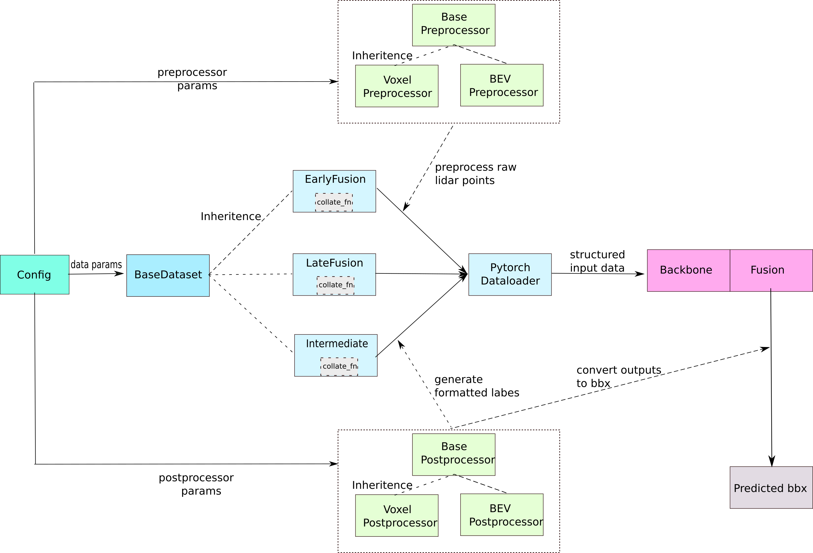

## Tutorial 3: OpenCOOD Pipeline

---


In this tutorial, we will go through the pipeline of OpenCOOD from loading data to generate structure predictions.
As the figure shown above, there are five important modules: **configuration system**, **data loading**, **preprocessor**, **postprocessor**, and **model**.

### Configuration System

---
The configuration system will read the yaml file defined by users to load all parameters for data I/O, training schema, and model. The configuration will be saved in a dictionary. Please refer to [tutorial 1](config_tutorial.md) for more details.

### Data Loading

---
As different fusion strategies can lead to different data processing (e.g., early fusion aggregates all raw
LiDAR point clouds whereas intermediate fusion aggregates intermediate deep features), we have three
distinct PyTorch dataset class: `EarlyFusionDataset`, `LateFusionDataset`, and `IntermediateFusionDataset`.
These three classes share the same interface and inherit from `BaseDataset`.

#### BaseDataset
There are two major tasks for `BaseDataset`. 
- First, given the path to the dataset, `BaseDataset` will construct a scenario database (dictionary format). The scenarior database is indexed by scenarior id, agent id and timestamp and returns file pathes for various sensors and saved yaml data. Here is an example of how the database structured:
```yaml

{scenario_id : 
    {agent_1 : 
       {timestamp1 : 
          {yaml: path (str),
           lidar: path (str), 
           cameras: alist of path to 4 dfferent cameras}}}}

```
- Second, during the runtime, given an index from PyTorch dataloader, `BaseDataset` will retrieve the corresponding path information from scenario database, load the data from disk and return the raw format data:
```yaml
{cav_id :
   {ego : True or False, # whether this CAV is regarded as ego
    params: a dictionary, # contains all metadata of this CAV and annotations for surrounding objects
    lidar_np: a (n, 4) numpy array for the raw point cloud,
    camera_rgbs: a list of rgb images from 4 cameras on the CAV.
   }
}
```

#### EarlyFusion, LateFusion, IntermediateFusion dataset
All of these 3 classes will inherit the `BaseDataset` to first construct a scenario database. During runtime, they will first call the `__get_item__` function from `BaseDataset` to get the raw format data. Next, they will do:

1. Project all objects' bounding box coordinates from Carla Map global reference to the ego vehicle's reference. Note that for late fusion, the CAV project to its own coordinate frame instead of the ego vehicle.
2. For early fusion and intermediate fusion, all agents will project their LiDAR point clouds to ego vehicle's coordinate frame.
3. Call the corresponding `PreProcessor` to convert the raw point clouds to voxel/bev features.
4. Call the corresponding `PostProcessor` to convert the objects annotation to the correct format for the loss computing.
5. Structure all the information in a dictionary. The processed format will be:
```yaml
{ agent_id:
   { 'object_bbx_center': numpy array, # the bounding boxes of all objects with padding 
     'object_bbx_mask': numpy array, # indicate the valid index for object_bbx_center
     'object_ids': a list of integer, # objects
     'anchor_box': numpy array, # pre-defined anchor box for detection
     'processed_lidar': numpy array, # voxel/bev features generated from preprocessor
     'label_dict': numpy array, # the groundtruth that can be directly used for computing loss during training 
   }
}
```
Notice here we just mention the general process and data format, these 3 classes have some differences in details.
For example, early fusion and intermediate fusion only have a single `agent_id` element -- `ego`, while late fusion
has multiple `agent_id`. Please read the code for more details.

#### Collate Function
As our data format is customized, all 3 dataset classes have their own `collate_fn` for the PyTorch dataloader.  The output of the collate function will be a similar dictionary as the one mentioned above except that all values are now in torch.Tensor format.

### Preprocessor and Postprocessor

---
The preprocessor is mainly used to convert the raw point clouds to voxels or 2D bev features (refer to PIXOR [paper](https://arxiv.org/abs/1902.06326)).

The postprocessor has three purposes:
- Convert the bounding boxes of the objects to the correct format so that the models can use to compute the loss.
- Generate the predefined anchor box if needed.
- Convert the output of the models to the correct format for evaluation and visualization.

### Models

---
All the models' architecture designs are saved in `opencood/models`. For early fusion and late fusion, each model file only have the backbone codes. For intermediate fusion, the model files have both backbone and fusion net codes. 